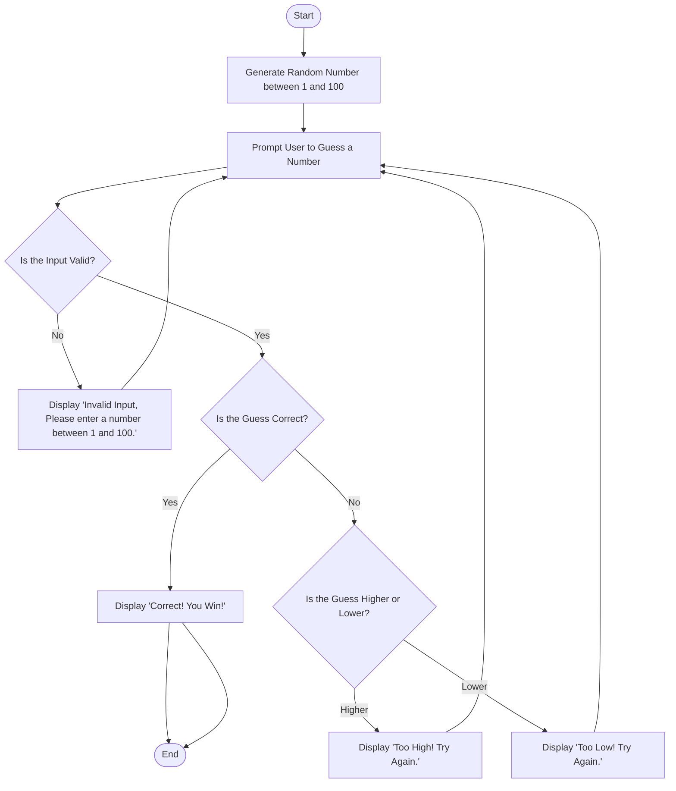

```mermaid
 flowchart TD
    Start([Start]) --> GenerateRandomNumber[Generate Random Number between 1 and 100]
    GenerateRandomNumber --> GetUserGuess[Prompt User to Guess a Number]
    
    GetUserGuess --> CheckValidInput{Is the Input Valid?}
    
    CheckValidInput -- No --> InvalidInputMessage[Display 'Invalid Input, Please enter a number between 1 and 100.'] --> GetUserGuess
    CheckValidInput -- Yes --> CompareGuess{Is the Guess Correct?}
    
    CompareGuess -- Yes --> CorrectMessage[Display 'Correct! You Win!'] --> End([End])
    CompareGuess -- No --> CheckHigherLower{Is the Guess Higher or Lower?}
    
    CheckHigherLower -- Higher --> TooHighMessage[Display 'Too High! Try Again.'] --> GetUserGuess
    CheckHigherLower -- Lower --> TooLowMessage[Display 'Too Low! Try Again.'] --> GetUserGuess
    
    CorrectMessage --> End([End])
```
